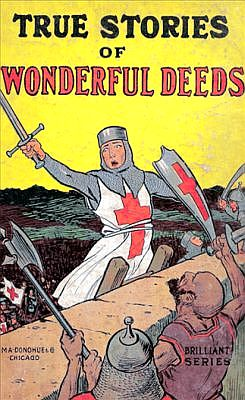
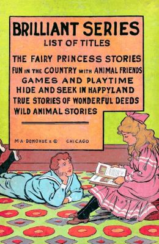
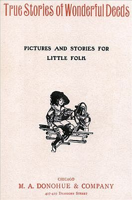

# *True Stories of Wonderful Deeds*, by *Anonymous*

This text is taken from the Project Gutenberg EBook of 
*True Stories of Wonderful Deeds*, by *Anonymous*.

>   True Stories of Wonderful Deeds

>   PICTURES AND STORIES FOR LITTLE FOLK

>   CHICAGO

>   M.A. DONOHUE & COMPANY.

>   407-429 DEARBORN STREET.

Transcriber's Note: Obvious mis-spellings and printing errors have been
corrected. Illustration captions marked with ° are supplied. All other
inconsistencies are as in the original.

The original eBook is for the use of anyone anywhere at no cost and with
almost no restrictions whatsoever.  You may copy it, give it away or
re-use it under the terms of the Project Gutenberg License included
with this eBook or online at www.gutenberg.org

Title
:   True Stories of Wonderful Deeds
:   Pictures and Stories for Little Folk

Author
:   Anonymous

Release Date
:   July 16, 2007 [EBook #22080]

Language
:   English

Character set encoding
:   ASCII

Online original version
:   <http://www.gutenberg.org/files/22080/22080-h/22080-h.htm>

Produced by Chris Curnow, Thomas Strong, Fox in the Stars
and the Online Distributed Proofreading Team at <http://www.pgdp.net>.

Creating the works from public domain print editions means that no
one owns a United States copyright in these works, so the Foundation
(and you!) can copy and distribute it in the United States without
permission and without paying copyright royalties.  Special rules,
set forth in the General Terms of Use part of this license, apply to
copying and distributing Project Gutenberg-tm electronic works to
protect the PROJECT GUTENBERG-tm concept and trademark.  Project
Gutenberg is a registered trademark, and may not be used if you
charge for the eBooks, unless you receive specific permission.  If you
do not charge anything for copies of this eBook, complying with the
rules is very easy.  You may use this eBook for nearly any purpose
such as creation of derivative works, reports, performances and
research.  They may be modified and printed and given away--you may do
practically ANYTHING with public domain eBooks.  Redistribution is
subject to the trademark license, especially commercial
redistribution.

See the [LICENSE](LICENSE) file of this directory for the full licence text.
