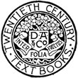

# A TEXT-BOOK OF ASTRONOMY

>   TWENTIETH CENTURY TEXT-BOOKS

>   EDITED BY
    A. F. NIGHTINGALE, PH.D., LL.D.
    FORMERLY SUPERINTENDENT OF HIGH SCHOOLS, CHICAGO

>   TWENTIETH CENTURY TEXT-BOOKS

>   A TEXT-BOOK OF ASTRONOMY

>   BY GEORGE C. COMSTOCK

>   DIRECTOR OF THE WASHBURN OBSERVATORY AND
    PROFESSOR OF ASTRONOMY IN THE
    UNIVERSITY OF WISCONSIN

>   NEW YORK
    D. APPLETON AND COMPANY
    1903

>   COPYRIGHT, 1901
    BY D. APPLETON AND COMPANY

This eBook is for the use of anyone anywhere at no cost and with
almost no restrictions whatsoever.  You may copy it, give it away or
re-use it under the terms of the Project Gutenberg License included
with this eBook or online at www.gutenberg.org

Title
:   A Text-Book of Astronomy

Author
:   George C. Comstock

Release Date
:   January 3, 2011 [EBook #34834]

Language
:   English

Character set encoding
:   UTF-8

Online original source
:   <http://www.gutenberg.org/files/34834/34834-h/34834-h.htm>

Produced by Chris Curnow, Iris Schimandle, Lindy Walsh and
the Online Distributed Proofreading Team at <http://www.pgdp.net>.

